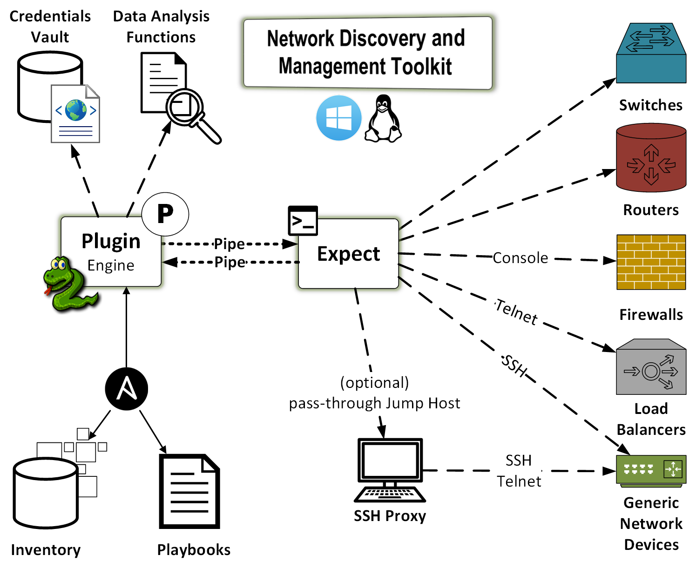

.. index::
   single: Workflow Diagram

============
Introduction
============

.. include:: localtoc.rst

Network Discovery and Management Toolkit
----------------------------------------

Network Discovery and Management Toolkit (`ndmtk`) makes Ansible *work* for
both Traditional and Software-Defined Network (SDN) network management.

Purpose
^^^^^^^

The future of network management lies in the area of Artificial Intelligence.
Any network-enabled device will be able to build connectivity to a remote peer
on-demand, without human intervention. The restraint on that ability are the
AI-enabled systems acting as gatekeepers. AI is impossible without ongoing
data collection, data analysis, probing, and modeling. As such, networks
of the future need tools to perform the above tasks.

This toolkit is designed to accomplish the data collection piece of the AI
puzzle. Specifically, the toolkit is designed to:

- discover data on network devices and capture the entirety of available data
- configure network devices via SSH, telnet, console, or terminal server
- collect, analyze, and store the data via command-line interactions;
  it performs data analysisn and, if necessary, it performs additional data
  collection and/or device configuration tasks.

Audience
^^^^^^^^

The intended audience of this toolkit are system and network engineers and
designers, as well as the researchers dealing with AI.

Artificial Intelligence (AI)
^^^^^^^^^^^^^^^^^^^^^^^^^^^^

The toolkit is delivered in a form of an Ansible plugin. However, it
could work well with Chef, or any other orchestration tool. The reason
Ansible became a framework of choice is its modularity. The toolkit itself
is modular. It allows extended existing functionality. For example, the
plugin does not blindly run pre-defined commands. Rather, it first collects
all of the commands forming the understanding of the function of a particular
device in a network. Once the plugin receives the data, it runs it through its
algorithms and determines whether there are any additional command required
to further gather data. That process continues until the algorithms determine
that the collection is complete.

The plugin has no required arguments and parameters, because there are
a number of default commands available for various operating systems,
e.g. Cisco Nexus OS, Arista EOS, Linux, etc.

Structured Data
^^^^^^^^^^^^^^^

Importantly, once the plugin completes its tasks it produces a number of reports
in JSON, YAML, and JUnit formats. These reports provide a map of what was done,
where the collected data reside, and what that data is.

Workflow Diagram
^^^^^^^^^^^^^^^^

|Plugin Workflow|

